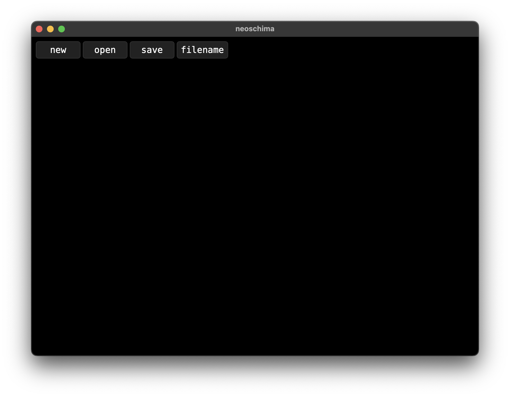
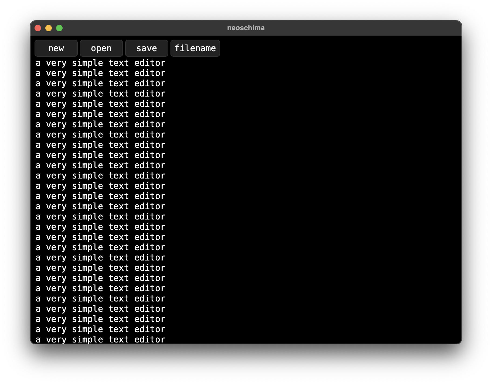

# neoschima

the simplest text editor that doesn't suck 🔥

without ai or bloatware

uses white text on a black background

cross platform supports windows, macos and linux

## previews 🏞️

### pictures of the text editor

picture of the editor



picture of the editor with text example



### app icon


## stack 💻

- HTML
- CSS
- JavaScript
- Rust
- Tauri

## buttons 🔲

- `new` for a new file
- `open` for opening a file
- `save` for saving a file
- `filename` for renaming a file

## shortcuts ⌨️

- `ctrl+n` for a new file
- `ctrl+s` for saving a file
- `ctrl+o` for opening a file

## how to build

### prerequisites

- node js
- npm
- rust
- tauri

### steps

- clone the repository
  
    ```bash
    git clone https://github.com/rayanalabbad/neoschima.git
    ```

- `cd` into the cloned repository
  
    ```bash
    cd neoschima
    ```

- run `npm install` to install dependencies
  
    ```bash
    npm install
    ```

- run `npm run tauri build` to build the application

    ```bash
    npm run tauri build
    ```

- and finally `cd` into `neoschima/src-tauri/target/release/bundle/` and find the application

    ```bash
    cd src-tauri/target/release/bundle
    ```

    and find the application for your operating system
